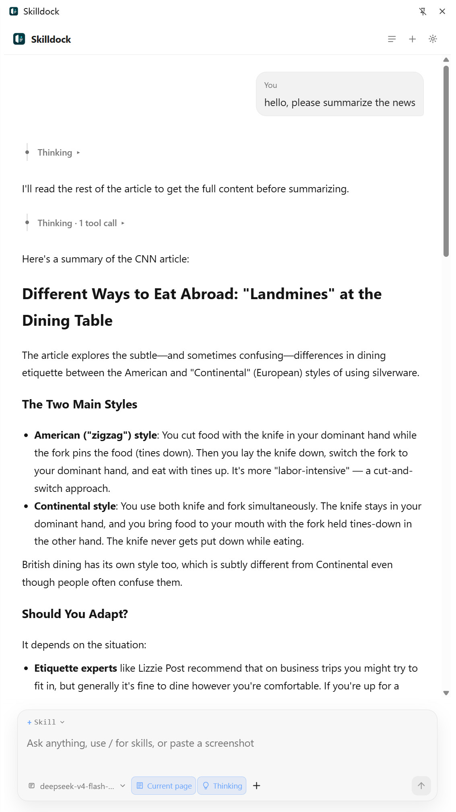
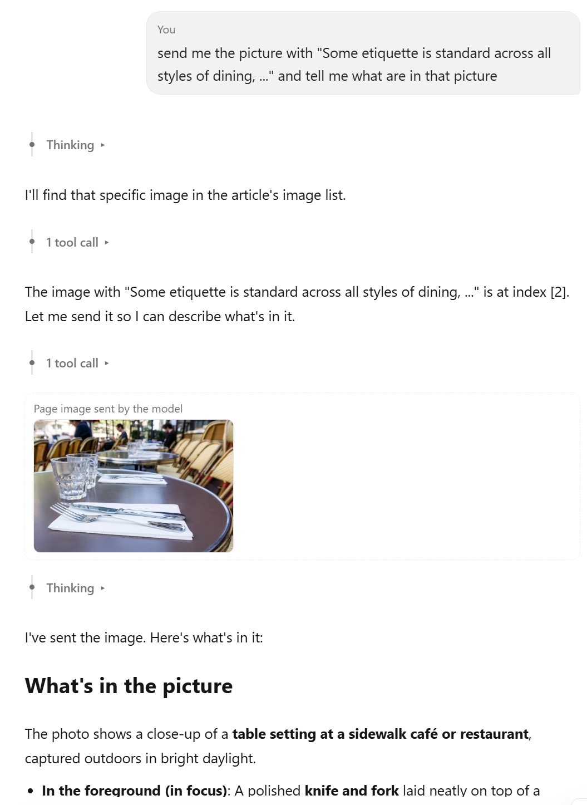
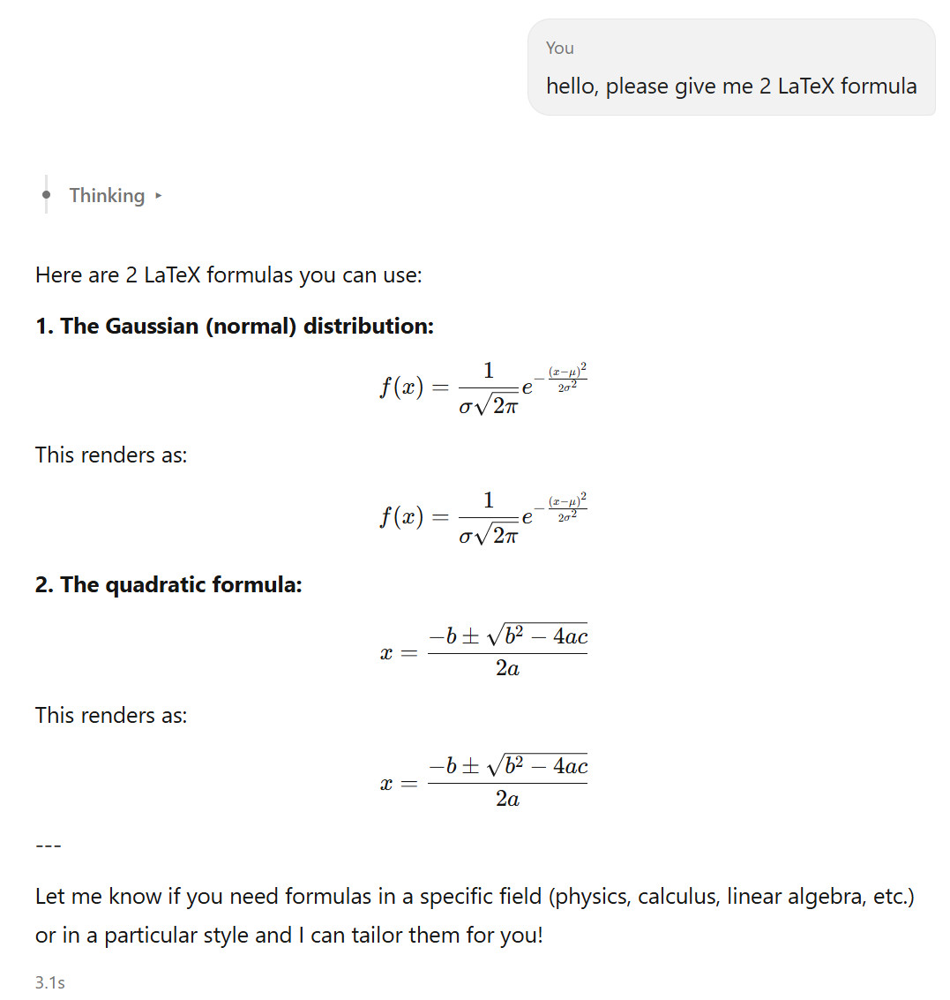
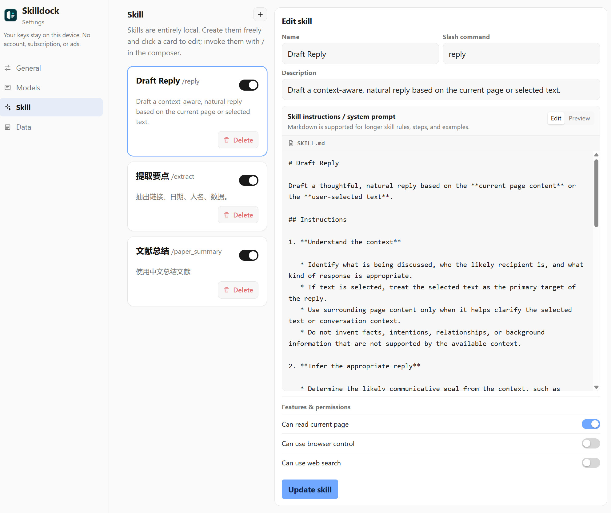

# Skilldock


**停靠在每个网页旁、由你掌控的私有 AI 工作区。**

Skilldock 是一个从头实现的 Chromium Manifest V3 浏览器扩展：它把使用自有 API Key 的 AI 对话侧边栏放到正在阅读的网页旁。项目采用本地优先设计，不需要账户、订阅、广告、云同步或技能市场。

[English](README.md)

> **仓库介绍：** 一个面向 Chrome 的私有、本地优先 AI 侧边栏——支持自定义技能、网页上下文和多种模型服务商。

## 界面展示

**网页旁的对话**——侧边栏在浏览时保持停靠，提问可附带当前页正文内容。



**支持发送与阅读图片**——可粘贴截图或附带页面图片，支持视觉的模型能够看图作答。



**LaTeX 公式渲染**——模型回复中的公式经 KaTeX 渲染，配合 Markdown 与流式输出更易阅读。



**自定义技能**——用斜杠命令、Markdown 指令和逐项权限（读网页、联网搜索、浏览器工具）搭建你自己的技能。



## 主要功能

- **理解网页上下文**：提问时可附带当前页正文和相关图片，也可以附加其他标签页。
- **自带模型服务商**：支持 OpenAI、Anthropic、Google Gemini、OpenRouter、Ollama，以及任意 OpenAI 兼容接口。
- **由你定义的技能**：用 `/` 调用可复用提示词；可设置快捷技能，以及每个技能能否读取网页、联网搜索或使用浏览器工具。
- **无需堆积标签页的网页研究**：搜索结果包含标题、URL 和摘要；助手可直接读取选定的公开结果页，无需打开标签页。
- **网页内辅助**：划词工具条、快捷问浮窗，以及可选的输入框写作圆点。
- **附件与 PDF 阅读**：可粘贴截图、附加文本文件和 PDF；用内置查看器阅读 PDF 后直接带去提问。
- **谨慎的浏览器操作**：读取页面、列标签页、提取链接、页内搜索，以及可选的点击、填写、滚动、开标签页。可能改变页面的操作会先征求确认。
- **对话归你所有**：本地历史、对话分叉、Markdown/PDF 导出和 JSON 备份/导入。
- **适合阅读的回复**：流式输出、可折叠的工具/思考过程、Markdown 和 KaTeX 公式。

## 隐私与数据流

Skilldock 将设置、服务商配置、API Key、技能和对话历史保存在 `chrome.storage.local`。项目不运行 Skilldock 服务端，也不要求注册账户。

发送消息时，所选模型服务商会收到你的消息，以及你明确附加或已开启的上下文（例如页面正文、附件和页面图片）。只有开启全局「允许联网搜索」时扩展才会请求 DuckDuckGo 的 HTML 搜索接口，并可能读取选定的公开结果页用于回答；使用自定义技能时，该技能也必须允许联网搜索。处理敏感信息前，请先查阅相应模型服务商的隐私条款。

## 从源码安装

1. 克隆或下载本仓库。
2. 在 Chrome 或其他 Chromium 浏览器中打开 `chrome://extensions`。
3. 打开「开发者模式」。
4. 点击「加载已解压的扩展程序」，选择仓库根目录。
5. 点击工具栏图标打开侧边栏，并在「设置」中添加服务商和模型。

修改源码后，回到 `chrome://extensions` 点击扩展卡片上的刷新按钮即可生效。

## 快速开始

1. 打开「设置」，为至少一个服务商填入 API Key；Ollama 不需要 Key。
2. 在侧边栏选择服务商与模型。
3. 直接提问。默认情况下，Skilldock 会附带当前标签页中可读的正文内容。
4. 输入 `/` 选择技能，或在网页中选中文字使用页面内工具。

### Ollama

默认 OpenAI 兼容地址为 `http://127.0.0.1:11434/v1`。如本地 Ollama 未允许扩展来源，可按需设置：

```powershell
set OLLAMA_ORIGINS=*
```

重启 Ollama 后，在设置页面点击「拉取模型列表」。

## 快捷键

| 快捷键 | 操作 |
| --- | --- |
| `Alt+S` | 打开 Skilldock 侧边栏 |
| `Alt+Q` | 开关当前网页内的快捷问 |
| `Enter` | 发送消息 |
| `Shift+Enter` | 换行 |

## 项目结构

```text
background/   扩展 Service Worker 与工具执行
content/      划词工具、快捷问、网页正文提取
sidepanel/    主对话界面
settings/     服务商、技能、备份与偏好设置
viewer/       内置 PDF 查看器
print/        对话打印视图
shared/       存储、服务商适配、Markdown、PDF 辅助代码
vendor/       KaTeX、PDF.js 等随扩展分发的第三方资源
```

项目采用原生 JavaScript，不需要构建步骤或运行时依赖。第三方浏览器资源置于 `vendor/`，许可证见各自目录。

## 开发检查

以「加载已解压」方式安装扩展后，在 Chrome 中走一遍受影响的交互流程。`checkpoints/` 中还包含面向服务商请求格式的定向冒烟脚本；它们是静态检查，不能代替浏览器 UI、真实 API 凭据或浏览器操作确认流程的实际验证。

## 项目边界

Skilldock 为独立实现。可以将它与其他浏览器 AI 助手并排比较，但本项目不包含其他产品的源码、素材、品牌、账户体系、支付系统、云同步或技能市场。

## 许可证

[MIT](LICENSE)
